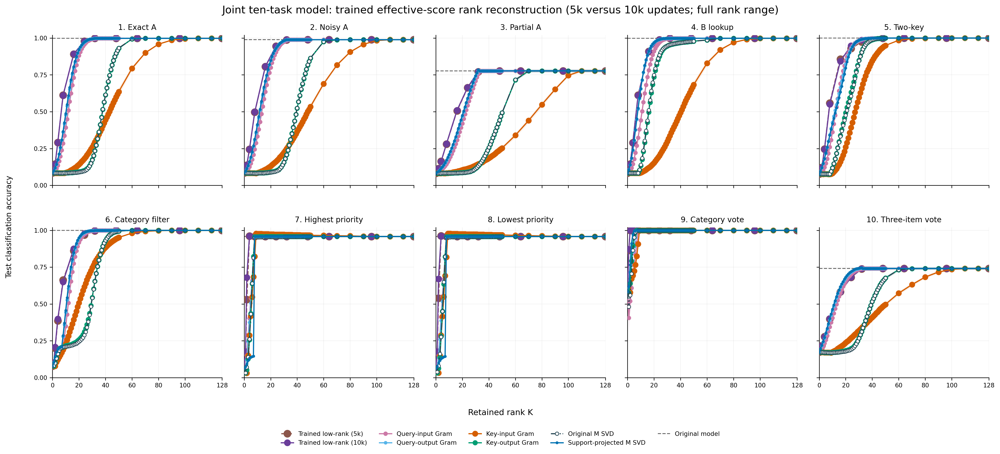
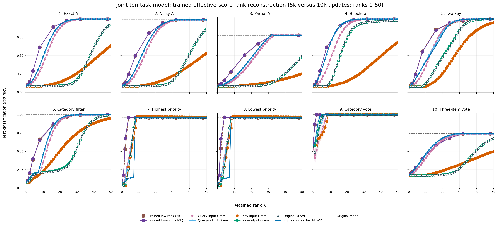
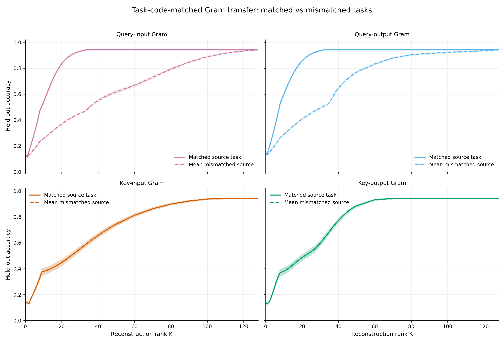

# Connecting Structure to Function in an Attention Layer Trained on Multiple Tasks

## Motivation

A weight matrix can be low rank without revealing which of its directions actually support a model's behavior. Truncated singular-value decomposition (SVD), for example, preserves directions with high parameter-space energy but does not use the input distribution and is not task specific. Conversely, a low-rank matrix trained to reproduce a network's outputs is function aware, but it does not explain whether the relevant directions can be read directly from the network's activity.

This repository tests a concrete bridge between these views. We train a controlled, single-layer attention model jointly on ten tasks and ask whether task-conditioned activation Gram matrices identify low-dimensional subspaces of its effective attention-score matrix that preserve held-out behavior. We compare those activity-selected subspaces with both ordinary SVD of the full effective matrix and SVD restricted to the task's observed query/key input supports, as well as rank-constrained matrices optimized to reproduce the frozen model's logits.

## Table of contents

1. [Motivation](#motivation)
2. [Experimental setup](#experimental-setup)
   - [Task suite](#task-suite)
   - [Architecture and training](#architecture-and-training)
3. [Identifiability methods](#identifiability-methods)
   - [The factorization-invariant object](#the-factorization-invariant-object)
   - [Four Gram reconstructions](#four-gram-reconstructions)
   - [Baselines and evaluation](#baselines-and-evaluation)
4. [Results](#results)
   - [Primary reconstruction experiment](#primary-reconstruction-experiment)
   - [Task-transfer control](#task-transfer-control)
5. [Scope of the conclusion](#scope-of-the-conclusion)
6. [Reproducibility](#reproducibility)
7. [Project note and acknowledgements](#project-note-and-acknowledgements)

## Experimental setup

### Task suite

Each example contains a query and 64 context records. The target is one of 32 class labels. Before mixing, every context record is a 128-dimensional vector containing two independent 32-dimensional keys (`A` and `B`), a 32-way one-hot label, an 8-way one-hot category, a scalar priority, a constant coordinate, and reserved coordinates. The query occupies the same 128-dimensional space, but its label coordinates are always zero; it instead contains the task-relevant key/category information and a 10-way task one-hot.

For every model seed, separate fixed orthogonal matrices mix the latent query and context coordinates. The model therefore sees dense 128-dimensional vectors rather than the hand-designed coordinate blocks. The query and context transforms are distinct and full rank.

The orthogonal mixing makes individual observed coordinates dense, but it does not eliminate unused linear combinations. Across the calibrated task distributions, the query-input support has rank 8, 33, 40, or 65 depending on the task, while the context/key-input support has rank 104. This distinction motivates the support-projected SVD baseline below: a raw SVD of the full 128-by-128 matrix can spend rank on directions that no query or context ever occupies.

| # | Task | Required operation |
|---:|---|---|
| 1 | Exact A lookup | Return the label of the record whose A-key exactly matches the query A-key. |
| 2 | Noisy A lookup | Retrieve by an A-query correlated with the target A-key by the locked coefficient $\rho=0.9$. |
| 3 | Partial A lookup | Retrieve when only 16 of the 32 target A-key coordinates are present in the query. |
| 4 | B lookup | Retrieve by an exact match in the independent B-key space. |
| 5 | Two-key lookup | Find the unique record matching both A and B while separate distractors match only A or only B. |
| 6 | Category-filtered lookup | Match A while using the queried category to reject an A-matched distractor from another category. |
| 7 | Highest priority | Among the eight records in the queried category, return the label of the highest-priority record. |
| 8 | Lowest priority | Among the eight records in the queried category, return the label of the lowest-priority record. |
| 9 | Category majority vote | Among seven records in the queried category, return the majority label (four versus three). |
| 10 | Three-item vote | Use an aggregate of three A-keys to find three voters and return their majority label in the presence of two correlated distractors. |

Examples are generated online from deterministic seed namespaces; no external dataset is used. See [TASKS.md](docs/TASKS.md) for the compact task specification and [ten_task_attention.py](src/identifiability_llm/ten_task_attention.py) for the generators.

### Architecture and training

The model has one attention head and one attention layer. For query $q\in\mathbb{R}^{128}$ and context vectors $x_i\in\mathbb{R}^{128}$, the computation is:

| Stage | Definition |
|---|---|
| Query, key, and value projections | $q'=W_Q q,\quad k_i'=W_K x_i,\quad v_i=W_V x_i$ |
| Attention score for context item $i$ | $s_i=\gamma {q'}^\top k_i'$ |
| Attention weight for context item $i$ | $\alpha_i=\mathrm{softmax}(s)_i$ |
| Retrieved value | $r=\sum_{i=1}^{64}\alpha_i v_i$ |
| Attention output | $o=W_O r$ |
| Readout layer (class logits) | $\ell=W_R o+b_R$ |

Here $W_Q,W_K,W_V,W_O\in\mathbb{R}^{128\times128}$, $W_R\in\mathbb{R}^{32\times128}$, and the fixed attention scale is $\gamma=0.25$. The vector $o\in\mathbb{R}^{128}$ is the output of the attention layer. The vector $\ell\in\mathbb{R}^{32}$ contains the pre-softmax class logits produced by the readout layer, and the predicted class is $\arg\max_j\ell_j$.

The architecture deliberately excludes residual connections, an MLP, normalization, positional encoding, and any query-label bypass. The Q, K, V, and O maps have no biases; only the final 32-way readout has a bias. This isolation ensures that every context-dependent prediction passes through the single attention operation.

We train 20 independently initialized models. Every model is trained jointly on all ten tasks for 6,000 optimizer updates. At each update, the generator contributes 256 fresh examples from each task, the ten batches are concatenated, and one equal-exposure cross-entropy update is taken. Thus each model sees 1,536,000 examples per task and 15,360,000 examples in total. Calibration and held-out evaluation use separate deterministic namespaces, with 2,048 calibration examples and 4,096 test examples per task and seed.

## Identifiability methods

### The factorization-invariant object

The query-key score can be written directly in the observed input coordinates:

$$
s(q,x)=\gamma(W_Qq)^\top(W_Kx)=q^\top Mx,
\qquad M=\gamma W_Q^\top W_K\in\mathbb{R}^{128\times128}.
$$

$W_Q$ and $W_K$ are not separately identifiable from the scores. For any invertible matrix $A$, the change

$$
W_Q\mapsto AW_Q,\qquad W_K\mapsto A^{-\top}W_K
$$

leaves $M$, and therefore every attention score, unchanged. The reconstruction target is consequently the factorization-invariant effective score matrix $M$, not the individual Q and K parameters.

Here “identifiability” is operational: we ask which low-dimensional directions of the trained $M$ can be selected from task-conditioned activity and are sufficient to preserve the model's input-output behavior. We are not attempting to recover a unique ground-truth parameterization of Q and K.

### Four Gram reconstructions

For each model seed and task, we compute empirical second moments on the 2,048-example calibration split. Let $G_q=\mathbb{E}[qq^\top]$ over queries and $G_x=\mathbb{E}[xx^\top]$ over all $2{,}048\times64$ context vectors. Propagating each argument through the bilinear map gives two additional Grams:

$$
G_{M^\top q}=M^\top G_qM,
\qquad
G_{Mx}=MG_xM^\top.
$$

For a positive-semidefinite matrix $G$, let $P_{G,K}$ be the orthogonal projector onto its leading $K$ eigenvectors. The four reconstructions, each of rank at most $K$, are:

| Method | Activity whose Gram is used | Gram matrix | Reconstructed effective matrix |
|---|---|---|---|
| **Query-input** | Query before $M$ | $G_q=\mathbb{E}[qq^\top]$ | $\widehat M_K=P_{G_q,K}M$ |
| **Query-output** | Query propagated through $M^\top$ | $G_{M^\top q}=M^\top G_qM$ | $\widehat M_K=MP_{G_{M^\top q},K}$ |
| **Key-input** | Context/key input before $M$ | $G_x=\mathbb{E}[xx^\top]$ | $\widehat M_K=MP_{G_x,K}$ |
| **Key-output** | Context/key input propagated through $M$ | $G_{Mx}=MG_xM^\top$ | $\widehat M_K=P_{G_{Mx},K}M$ |

Every reconstruction still uses the trained $M$ itself; the Gram matrix determines which rank $K$ projector is applied to it. The experiment therefore tests activation-aware subspace selection and behavioral sufficiency, not recovery of $M$ from a Gram matrix alone.

“Output” in these names means the output of one argument under the bilinear map $M$ or $M^\top$; it does **not** mean the projected transformer features $W_Qq$ or $W_Kx$. Query-input and key-output project $M$ from the left, whereas query-output and key-input project it from the right. At $K=0$ every reconstruction is zero; at $K=128$ every complete projector is the identity and all four reconstructions equal $M$.

The analytic rank grid is dense from $K=0$ through $50$, followed by $K\in\{60,70,80,90,100,110,120,128\}$. The implementation audits Gram symmetry and positive semidefiniteness, both propagated-Gram identities, projector idempotence, and the numerical rank bound for every reconstruction.

### Baselines and evaluation

We compare the four Gram methods with four references. The first two are complementary SVD baselines:

1. **Original SVD of $M$.** If $M=U\Sigma V^\top$, its rank $K$ reconstruction is $\widehat M_K=U_{:K}\Sigma_{:K}V_{:K}^\top$. This is the optimal rank $K$ Frobenius approximation to the full trained matrix. It is task agnostic: the singular directions are ranked using all of the 128-dimensional matrix, including directions that the task's queries or contexts never occupy.
2. **Support-projected SVD (reduced SVD).** Let $U_q$ and $U_x$ contain every eigenvector of the task's input Grams $G_q$ and $G_x$ whose eigenvalue exceeds $10^{-10}$ times that Gram's largest eigenvalue. We first reduce $M$ to the compact supported operator $B=U_q^\top M U_x$. If $B=\widetilde U\widetilde\Sigma\widetilde V^\top$, the rank $K$ reconstruction lifted back to the original coordinates is $\widehat M_K=U_q\widetilde U_{:K}\widetilde\Sigma_{:K}\widetilde V_{:K}^\top U_x^\top$. Equivalently, its full supported target is $M_{\mathrm{supp}}=P_qMP_x$, with $P_q=U_qU_q^\top$ and $P_x=U_xU_x^\top$. This is the optimal rank $K$ Frobenius approximation to $M_{\mathrm{supp}}$, not to raw $M$.
3. **Cumulative projected-SVD power.** The generated tables record the cumulative squared-singular-value fraction of $M_{\mathrm{supp}}$. It reaches one when $K$ reaches the supported operator's rank. This diagnostic is retained in the data but omitted from the main figures so that the plotted curves all use the same behavioral-accuracy axis.
4. **Trained functional low rank.** For each seed, task, and trainable rank, a factorized matrix $A_KB_K$ replaces $M$ while the teacher's value, output, and readout paths remain frozen. Its factors are initialized from the rank $K$ SVD of $M$ and optimized along one 10,000-step trajectory to match the frozen teacher's class logits on calibration inputs; ground-truth labels are not used. The 5k and 10k results select the checkpoint with the lowest normalized teacher-logit MSE observed up to the corresponding horizon, including step zero. Rank 0 and rank 128 are boundary controls rather than optimized conditions. This is a trained functional reference, not a certificate of the globally optimal rank $K$ solution.

| Property | Original SVD of $M$ | Support-projected SVD |
|---|---|---|
| Matrix decomposed | Full $128\times128$ matrix $M$ | Compact task-specific operator $U_q^\top M U_x$ |
| Uses task-conditioned calibration activity | No | Yes, to estimate the complete non-null query and context supports |
| Rank $K$ optimality | Frobenius error to raw $M$ | Frobenius error to $P_qMP_x$ |
| Full retained rank | Recovers $M$ at $K=128$ | Recovers $P_qMP_x$ once $K$ reaches the supported operator rank |

The support-projected reconstruction need not equal raw $M$ as a matrix. It nevertheless produces the same scores $q^\top Mx$ whenever $q$ and $x$ lie in the estimated input supports. Thus this baseline removes exactly inactive directions before asking how many singular components the task-relevant operator needs; it is not a trained or accuracy-optimized reconstruction. The support cutoff is invariant across relative tolerances from $10^{-8}$ to $10^{-12}$ in these data.

The support-projected SVD was added as a post-hoc fairness baseline after noticing the exact null input directions. The final figures show it alongside the original locked SVD of $M$. The support bases use calibration inputs only; held-out test inputs and labels are never used to construct them.

Every reconstructed matrix is inserted into the exact direct $M$ forward pass while $W_V$, $W_O$, and the readout remain fixed. The primary outcome is classification accuracy on 4,096 untouched test examples per task and seed. Secondary recorded metrics include accuracy retention, attention KL divergence, centered score MSE, relative matrix error, and numerical rank. See [METHODS.md](docs/METHODS.md) for the full derivation.

## Results

### Primary reconstruction experiment



**Figure 1a — Full-range reconstruction benchmark.** Each panel is one task. Colored curves show mean held-out accuracy across 20 independently trained models; shaded regions are $\pm1$ standard deviation across seeds. The gray dashed line is the corresponding full-model accuracy. Original SVD of $M$ is the dark dash-dot curve with hollow markers; support-projected SVD is the solid blue curve with filled markers. The four Gram reconstructions and both SVD baselines are evaluated at 59 ranks; the trained functional references are reported on the 12-rank grid shown by their markers. Every plotted curve uses the behavioral-accuracy axis. ([PDF](figures/main/full_range_20seeds.pdf))



**Figure 1b — Low-rank zoom.** The same estimates, uncertainty bands, and visual encodings as Figure 1a, restricted to $K=0$ through $50$, where the behavioral transitions are easiest to compare. No values are recomputed for this view. ([PDF](figures/main/zoom_K0_50_20seeds.pdf))

The correction changes the comparison materially. Once both exact input null spaces are removed, support-projected SVD is the strongest analytic reference on average. Query-output Gram nevertheless tracks it closely: it ties the support-projected SVD's $K_{95}$ on seven tasks and trails by only one rank on partial A and category-filtered lookup and by two ranks on category majority vote. No Gram method beats the support-projected SVD at $K_{95}$. Thus the earlier gap from SVD of raw $M$ was substantially explained by unsupported matrix directions; the remaining result is that a one-sided, task-conditioned query-output Gram nearly matches the two-sided support-aware SVD and the trained functional reference.

Define $K_{95}$ for each task and method as the smallest reported rank at which the 20-seed mean accuracy reaches 95% of that task's mean full-model accuracy. Averaging those ten task-level thresholds gives:

| Method | Mean task-level $K_{95}$ |
|---|---:|
| Support-projected SVD | 18.5 |
| Query-output Gram | 18.9 |
| Trained functional low rank (5k or 10k) | 20.2 |
| Query-input Gram | 20.3 |
| Original SVD of $M$ | 37.9 |
| Key-output Gram | 37.9 |
| Key-input Gram | 57.7 |

Exact comparison with the trained baseline is approximate because its reported rank grid is substantially coarser.

Training the functional baseline for 10,000 rather than 5,000 steps lowered its selected normalized logit loss in 1,482 of 2,000 paired seed/task/rank conditions and increased mean accuracy by 0.00339. It did not change the task-averaged $K_{95}$ (20.2) or $K_{99}$ (25.0), indicating that the longer optimization modestly improves fit without changing the overall behavioral-rank conclusion.

### Task-transfer control

The primary experiment computes and evaluates each Gram on the same task. To test whether success reflects genuinely task-specific activity rather than only the explicit task one-hot, the control considers every ordered Gram-source/evaluation-task pair $(t,s)$. Calibration examples are generated from source task $t$. **During Gram computation only**, the calibration query's task one-hot is replaced by task $s$'s one-hot. The resulting basis is then evaluated on ordinary, untouched held-out examples from task $s$. Test queries, contexts, labels, and targets are never replaced.



**Figure 2 — Task-code-matched transfer control.** Solid curves use the Gram from the same task as evaluation; dashed curves average the nine incorrect Gram-source tasks after matching the explicit query task code. Curves average 200 seed/evaluation-task observations (20 seeds $\times$ 10 evaluation tasks), and bands show $\pm1$ SEM across those observations. The control contains 472,000 evaluated conditions across all ranks and ordered task pairs. ([PDF](figures/controls/matched_vs_mismatched_curves.pdf))

At $K=24$, the aggregate held-out accuracies are:

| Gram method | Matched source | Mean mismatched source | Matched advantage |
|---|---:|---:|---:|
| Query-input | 0.890 | 0.407 | 0.483 |
| Query-output | 0.902 | 0.444 | 0.458 |
| Key-input | 0.488 | 0.487 | 0.001 |
| Key-output | 0.523 | 0.523 | 0.000 |

Matching the task code does not rescue a query-side Gram computed from the wrong task distribution. This supports the specific conclusion that the query-input Gram—and its algebraically propagated query-output counterpart—contains task-specific low-dimensional structure beyond the explicit one-hot coordinates. The key/context-side Grams show no comparable specificity in this suite. As required, all matched-versus-mismatched differences vanish at $K=128$, where every full-rank projector is the identity.

## Scope of the conclusion

These experiments demonstrate behavioral sufficiency of activity-selected low-rank subspaces in a controlled synthetic attention model. They do not establish unique parameter recovery, causal necessity of individual Gram eigenvectors, global optimality of the trained low-rank baseline, or immediate generalization to natural-language transformers. The synthetic inputs occupy deliberately restricted subspaces, and the support-projected control shows that this fact explains much of the original advantage over raw SVD. Query-input and query-output are algebraically related through $G_{M^\top q}=M^\top G_qM$, while key-input and key-output are related through $G_{Mx}=MG_xM^\top$. The four curves should therefore be interpreted as paired views of query- and key-conditioned structure, not as four independent discoveries.

Additional documentation is available in [RESULTS.md](docs/RESULTS.md), [TASKS.md](docs/TASKS.md), [METHODS.md](docs/METHODS.md), and [CODE_MAP.md](docs/CODE_MAP.md).

## Reproducibility

### Repository layout

```text
attention-identifiability/
├── configs/       # Locked experiment and learned-low-rank settings
├── docs/          # Methods, tasks, results, and reproduction guide
├── figures/       # Versioned paper figures
├── protocols/     # Hash-locked reproducibility records
├── scripts/       # Every executable entry point
├── src/           # Model, generators, reconstruction, and training library
├── tests/         # Deterministic unit and invariant tests
└── data/          # Generated locally; excluded from Git
```

All generated checkpoints, per-seed records, aggregate tables, audits, manifests, and logs live under `data/`. The entire directory is ignored by Git.

### Installation

Python 3.11 is recommended.

```bash
python3.11 -m venv .venv
source .venv/bin/activate
python -m pip install --upgrade pip
python -m pip install -e .
```

### Reproduce the experiment

First validate the configuration, protocol hashes, architecture, generators, and reconstruction identities:

```bash
python scripts/run_experiment.py --stage validate --workers 4
```

Then run the complete 20-seed experiment:

```bash
python scripts/run_experiment.py --stage all --workers 4
```

The pipeline is resumable and can also be run stage by stage:

```bash
python scripts/run_experiment.py --stage train --workers 4
python scripts/run_experiment.py --stage reconstruct --workers 4
python scripts/run_experiment.py --stage low-rank --workers 4
python scripts/run_experiment.py --stage support-svd --workers 4
python scripts/run_experiment.py --stage controls --workers 4
python scripts/run_experiment.py --stage finalize --workers 4
```

By default, outputs go to `./data`. To use another disk:

```bash
export ATTENTION_IDENTIFIABILITY_DATA=/path/to/attention-identifiability-data
python scripts/run_experiment.py --stage all --workers 4
```

The complete stage contract, output tree, expected row counts, and audit conditions are in [REPRODUCIBILITY.md](docs/REPRODUCIBILITY.md).

## Project note and acknowledgements

This is an exploratory—and intentionally fun—project with two complementary aims. First, I wanted to evaluate Codex as a research agent across a complete scientific workflow. I provided the scientific ideas, hypotheses, and experimental scaffolding; Codex worked more like an “overly talented intern,” translating that direction into code, running the experiments, implementing controls, auditing reproducibility, and helping organize the results. I will discuss what I learned from that process in a separate blog post.

Second, the underlying scientific question—how the structure of a high-dimensional network gives rise to its function—has long been central to my research. My PhD work examined this problem in biological neural networks, culminating in our [geometric and dynamical theory of latent computations](https://www.biorxiv.org/content/10.64898/2026.07.10.737763v1). I am now exploring related ideas in the context of LLM interpretability.

I thank OpenAI for providing access to Codex and enabling this experiment.
